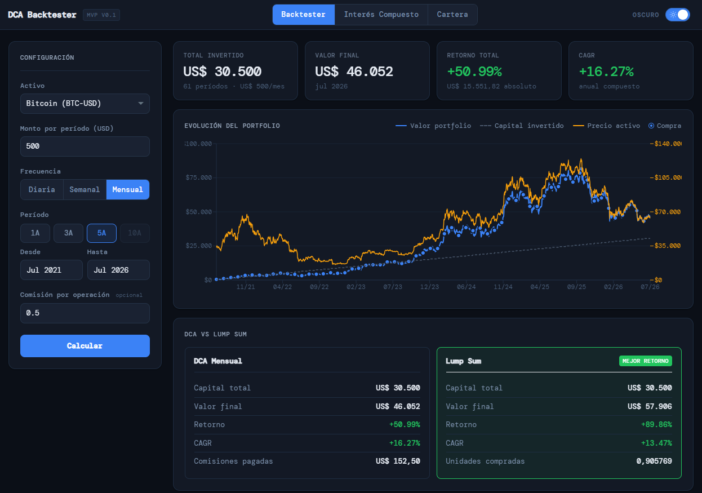

# DCA Backtester

[](https://github.com/MalmstenTheo0/backtesting/actions/workflows/ci.yml)


Simulá qué habría pasado si hubieras invertido un monto fijo, todos los meses, durante
los últimos años. Datos históricos reales de cripto y ETFs, y la comparación contra
haber invertido todo de una sola vez.

<!--
  TODO: falta el screenshot. Guardá la captura de la app como docs/assets/screenshot.png
  y la imagen de abajo aparece sola, sin tocar este archivo.
-->


## ¿Qué es DCA?

**Dollar Cost Averaging** es invertir siempre el mismo monto en intervalos regulares,
sin intentar adivinar cuándo el precio está bajo. Como el monto es fijo, comprás más
unidades cuando está barato y menos cuando está caro, y eso baja tu precio promedio de
entrada.

Con 100 USD por mes durante tres meses:

| Mes | Precio | Lo que comprás con 100 USD |
|---|---|---|
| 1 | 100 | 1.0 unidad |
| 2 | 50 | 2.0 unidades |
| 3 | 200 | 0.5 unidades |

Invertiste 300 USD y tenés 3.5 unidades: pagaste **85.7 de promedio**, aunque el precio
promedio del período fue 116.7. Esa diferencia es el efecto que mide esta app — y también
muestra cuándo *no* conviene, porque en un mercado que solo sube, invertir todo el día 1
rinde más. El backtester calcula las dos y las pone lado a lado.

## Qué hace

- **Backtest de DCA** sobre precios históricos reales, con frecuencia diaria, semanal o mensual.
- **Comisiones** configurables por operación, para que el resultado no sea optimista de más.
- **Comparación contra lump sum**: el mismo capital invertido de una sola vez el primer día.
- **Métricas**: capital invertido, valor final, retorno absoluto y porcentual, retorno anualizado ponderado por dinero (XIRR), unidades acumuladas y comisiones pagadas.
- **Gráfico** de la evolución del portfolio contra el capital invertido, marcando cada compra.
- **Calculadora de interés compuesto** y **asignador de cartera**, que corren enteramente en el navegador.
- Tema claro/oscuro.

Activos disponibles: `BTC-USD`, `ETH-USD`, `SOL-USD` (Binance) y `SPY`, `QQQ`, `VTI` (Alpha Vantage).

## Stack

| Capa | Tecnología |
|---|---|
| Backend | FastAPI · Python 3.12 |
| Cálculo | pandas · numpy |
| Frontend | React · TypeScript · Vite |
| Gráficos | Recharts |
| Estilos | Tailwind CSS |
| Datos | API pública de Binance (cripto) · Alpha Vantage `TIME_SERIES_WEEKLY_ADJUSTED` (ETFs) · caché CSV local |
| Calidad | pytest · ruff · Vitest · Testing Library · GitHub Actions |

## Cómo correrlo

### Docker (todo junto)

```bash
docker compose up --build
```

Frontend en `http://localhost:5173`, API en `http://localhost:8000/docs`.

### Local

Backend:

```bash
cd backend
python -m venv venv && source venv/bin/activate   # Windows: .\venv\Scripts\activate
pip install -r requirements.txt
uvicorn app.main:app --reload --port 8000
```

Frontend, en otra terminal:

```bash
cd frontend
npm install
npm run dev
```

### Sobre las claves de API

**Las cripto funcionan sin configurar nada**: Binance es pública. Para los ETFs hace falta
una clave gratuita de [Alpha Vantage](https://www.alphavantage.co/support/#api-key) en
`backend/.env` (copiá `backend/.env.example`). Con la clave gratuita los ETFs soportan
frecuencia semanal y mensual, no diaria.

## Tests

```bash
cd backend && pip install -r requirements-dev.txt && pytest
```

```bash
cd frontend && npm install && npm test
```

267 tests: 205 en el backend con 98% de cobertura sobre `app/`, y 62 en el frontend.
**No necesitan red ni claves de API**: una fixture `autouse` bloquea cualquier salida
HTTP y redirige el caché a un directorio temporal, así que la suite corre igual desde un
clone limpio y es determinista.

Qué se cubre en el backend:

- **Motor de cálculo** (`app/strategies/`, 100%): compras, comisiones, retorno anualizado,
  comparación contra lump sum y bordes como capital cero o series de un solo punto. Los
  valores esperados están calculados a mano en cada test, no copiados de la salida del
  código.
- **Alineación de períodos**: que un lunes feriado no haga perder la semana, y que el
  límite del año ISO (2019-12-30 pertenece a la semana 1 de 2020) se agrupe bien.
- **Caché**: sus dos condiciones de invalidación (antigüedad del archivo y frescura del
  último dato) y la lectura defensiva de CSV corruptos.
- **Fuentes de datos**: paginado, deduplicación y clasificación de errores de Binance y
  Alpha Vantage, con las respuestas HTTP mockeadas.
- **Contrato de la API**: validaciones del request y el mapeo de cada error de la capa de
  datos a su status code, extremo a extremo.

Y en el frontend: la traducción de los errores de FastAPI a texto para el usuario, el
guard contra respuestas fuera de orden cuando se cambia de activo con un pedido en vuelo,
y los bordes de calendario del selector de fechas.

Lint, formato y typecheck:

```bash
cd backend && ruff check . && ruff format --check .
```

```bash
cd frontend && npm run lint
```

## Documentación

Índice completo en [docs/README.md](docs/README.md).

- [SPEC.md](docs/SPEC.md) — qué construimos y por qué
- [ARCHITECTURE.md](docs/ARCHITECTURE.md) — decisiones técnicas y estructura
- [API.md](docs/API.md) — contratos de los endpoints
- [STRATEGY_GUIDE.md](docs/STRATEGY_GUIDE.md) — cómo agregar una estrategia nueva
- [DEVELOPMENT.md](docs/DEVELOPMENT.md) — setup, comandos y troubleshooting

## Alcance

Proyecto personal con fines educativos. Los resultados son simulaciones sobre datos
históricos y **no son asesoramiento financiero**: el rendimiento pasado no predice el
futuro. El motor implementa DCA tradicional; `dca_weighted` y `value_averaging` están
reservados en el contrato de la API y todavía no tienen implementación.

## Licencia

[MIT](LICENSE) © Theo Malmsten
